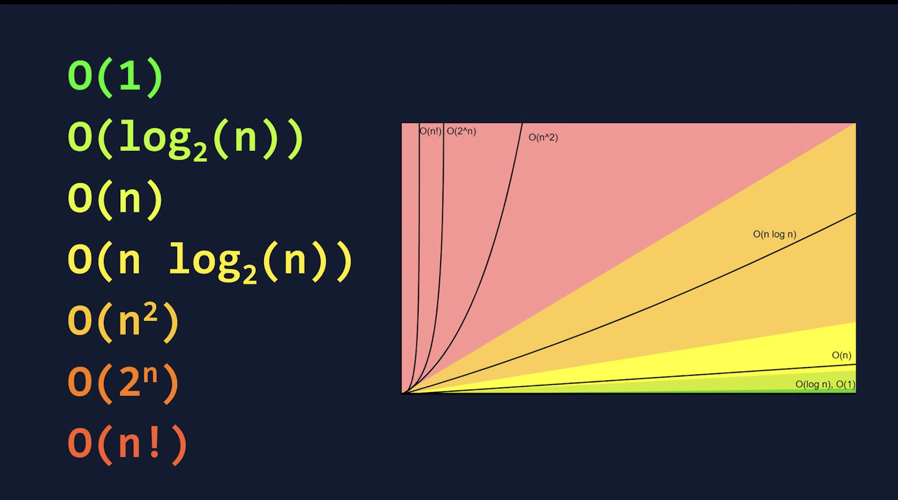

# Demystifying Big O Notation

## What is Big O, Really?

Imagine you have a recipe. Big O notation is like a quick summary that tells you how much longer it will take to cook if you want to make more servings.

*   If you're making one sandwich or ten, the time to toast one slice of bread is always the same. That's **Constant** time.
*   If you have to chop one vegetable for each sandwich, the time it takes grows directly with the number of sandwiches you make. That's **Linear** time.
*   If you have to introduce every person in a room to every other person, the number of introductions skyrockets as more people arrive. That's **Quadratic** time.

Big O doesn't care about the exact seconds it takes. It cares about the **growth trend**. It answers the question: "As my input gets bigger, how much slower will this algorithm get?" We call this **Time Complexity**.

It also answers a similar question for memory: "As my input gets bigger, how much more memory will this algorithm need?" We call this **Space Complexity**.

## The Graph of Growth

This graph is the most important visual for understanding Big O. It shows how quickly the number of operations (and thus, the time required) increases as the number of input elements (`n`) grows.

As you can see, you want to be in the "green zone" ($O(1)$, $O(\log n)$, $O(n)$) where your algorithm scales efficiently. The "red zone" ($O(n^2)$, $O(2^n)$) represents algorithms that become unusably slow with even moderately large inputs.

---

## Time Complexity: How Long Will It Take?

Time complexity measures the number of operations an algorithm performs to complete its task.

### Common Time Complexities (from Best to Worst)

| Notation | Name | Analogy | Code Example | Performance |
| :--- | :--- | :--- | :--- | :--- |
| **$O(1)$** | **Constant** | Finding a page in a book by its bookmark. It doesn't matter if the book has 50 or 500 pages. | Accessing an array element: `array[0]` | Excellent |
| **$O(\log n)$** | **Logarithmic** | Finding a word in a dictionary. You open to the middle, decide which half the word is in, and repeat. | `Binary Search` | Excellent |
| **$O(n)$** | **Linear** | Reading every page in a book. Double the pages, double the time. | Looping through a list: `for item in list: print(item)` | Good |
| **$O(n \log n)$** | **Linearithmic** | Sorting a deck of cards by repeatedly dividing it and merging. | `Merge Sort`, `Quick Sort` | Good |
| **$O(n^2)$** | **Quadratic** | Comparing every card in a deck to every other card. | Nested loops: `for i in list: for j in list: ...` | Poor for large inputs |
| **$O(2^n)$** | **Exponential** | A password cracker trying every possible combination of characters. | `Recursive calculation of Fibonacci sequence` | Terrible |
| **$O(n!)$** | **Factorial** | Calculating all possible routes to visit N cities (Traveling Salesman Problem). | Brute-force solutions to complex problems | Unusable |

---

## Space Complexity: How Much Memory Will It Use?

Space complexity measures the amount of memory (RAM) an algorithm needs to run, beyond the space taken up by the inputs themselves.

### Common Space Complexities

| Notation | Name | Explanation | Code Example |
| :--- | :--- | :--- | :--- |
| **$O(1)$** | **Constant** | The algorithm uses a fixed amount of extra memory, no matter the input size. Just a few variables. | Swapping two numbers in an array. |
| **$O(n)$** | **Linear** | The memory usage grows proportionally to the input size. | Creating a copy of an input array. |
| **$O(n^2)$** | **Quadratic**| The memory usage grows quadratically with the input size. | Creating an adjacency matrix for a graph. |

Understanding both time and space complexity is crucial for writing efficient and scalable code. An algorithm that is fast but uses too much memory might be just as unusable as a slow one. Always consider the trade-offs!
